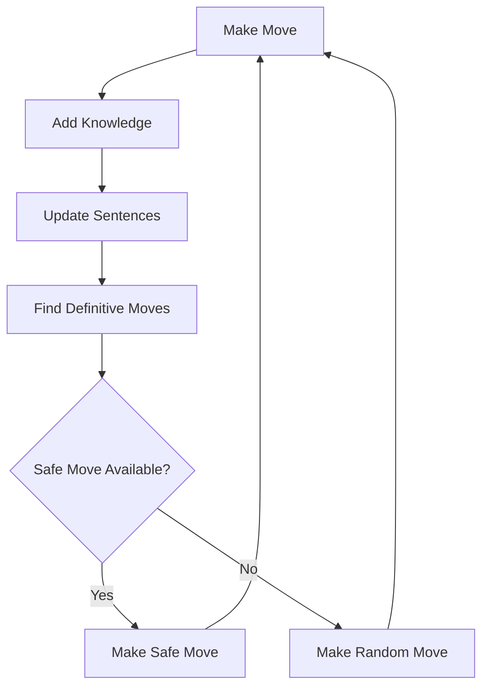

# AI Minesweeper

> A minimalist implementation of the classic Minesweeper game with an intelligent AI player that uses logical inference to make optimal moves.

## Overview

This project converts a Python-based AI Minesweeper implementation into a clean, browser-based game. The AI uses constraint satisfaction and logical deduction to identify safe moves and mine locations.

---

## Features

| Feature | Description |
|---------|-------------|
| **Classic Gameplay** | Standard 8x8 grid with 8 mines |
| **AI Player** | Intelligent agent using logical inference |
| **Minimalist Design** | Black and white interface, no distractions |
| **Real-time Stats** | Live tracking of moves, flags, and AI knowledge |

## Game Rules

1. **Left-click** to reveal a cell
2. **Right-click** to flag a suspected mine
3. Numbers indicate adjacent mine count
4. Flag all mines to win

## AI Architecture

The AI system consists of three main components:

### Sentence Class
```
Sentence(cells, count)
```
Represents logical statements about the game state:
- `cells`: Set of board positions
- `count`: Number of mines in those cells

### Knowledge Base
- Maintains a collection of sentences
- Updates based on new information
- Removes redundant or empty sentences

### Inference Engine
Uses **subset logic** to derive new knowledge:

> If sentence A is a subset of sentence B, then we can create sentence C = B - A

## Algorithm Flow



## Technical Details

<details>
<summary>Click to expand technical specifications</summary>

### Game Constants
- **Grid Size**: 8x8
- **Mine Count**: 8
- **Cell States**: Hidden, Revealed, Flagged

### AI Decision Process
1. **Safe Move Detection**: Identifies cells guaranteed to be safe
2. **Mine Detection**: Identifies cells guaranteed to contain mines
3. **Inference**: Creates new logical sentences from existing knowledge
4. **Random Fallback**: Makes educated guesses when logic is insufficient

</details>

---

## Usage

### Running the Game
Simply open the HTML file in any modern web browser. No server required.

### Controls
- **AI Move Button**: Let the AI make the next move
- **Reset Button**: Start a new game
- **Cell Interaction**: Standard Minesweeper controls

### Example Game Flow
1. Start with random move
2. AI analyzes revealed information
3. AI builds knowledge base of logical sentences
4. AI makes increasingly informed decisions
5. Game continues until win/loss

---

## Implementation Notes

> **Note**: This implementation prioritizes correctness and clarity over performance. The AI makes logical deductions in real-time without pre-computation.

### Key Algorithms

#### Knowledge Update
```python
def update_knowledge():
    while knowledge_changed:
        for sentence in knowledge:
            mark_definitive_mines()
            mark_definitive_safes()
        remove_empty_sentences()
```

#### Sentence Inference
```python
def infer_new_sentences():
    for sentence_a in knowledge:
        for sentence_b in knowledge:
            if is_subset(a, b):
                create_new_sentence(b - a)
```

---

## Project Structure

```
minesweeper/
├── index.html          # Complete game implementation
├── README.md           # This file
└── assets/             # Optional: future enhancements
```

## Browser Compatibility

| Browser | Support |
|---------|---------|
| Chrome  | Full |
| Firefox | Full |
| Safari  | Full |
| Edge    | Full |

**Minimum Requirements**: ES6 support, CSS Grid

---

## Contributing

### Code Style
- Use semantic HTML
- Maintain black/white color scheme
- Keep JavaScript modular
- Comment complex logic

### Testing Scenarios
- [ ] AI makes correct safe moves
- [ ] AI handles edge cases gracefully
- [ ] Game state updates properly
- [ ] UI responds to all interactions
